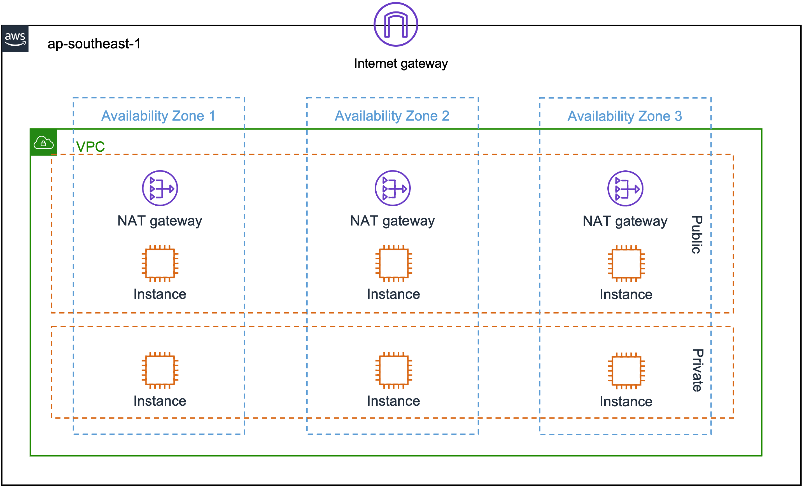
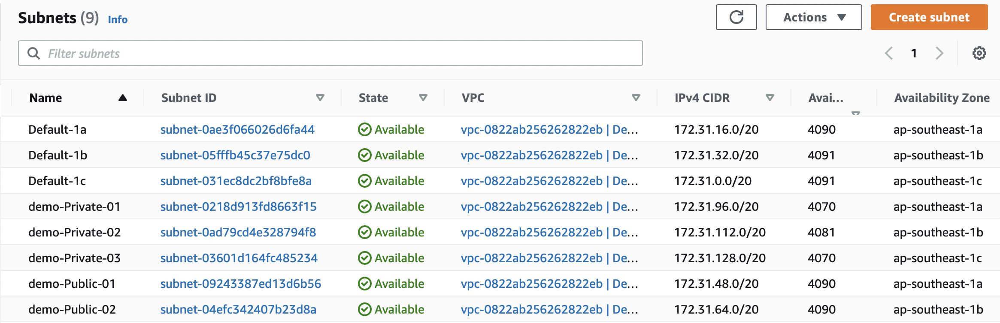

# 集群网络规划

EKS使用VPC-CNI网络插件，与很多用户熟知的Flannel/Calico/Cilium插件overlay网络方式不同，VPC-CNI在节点的ENI上为每一个POD分配了一个subnet的IP地址，并且每个节点支持的POD数量有默认限制。这样保证了POD的网络吞吐性能，也减少网络转发层数，降低网络延迟。因此在规划时需要注意每个subnet的CIDR，需要有足够的地址空间容纳POD。虽然每个节点有POD数量限制，但通过给节点分配Prefix可提高节点的POD数量，详细参考以下链接，这里不展开说明。

## 建议网络架构

EKS集群网络规划，一般根据需求，分为：

* Public and private subnets：建议所有生产部署使用此选项，此VPC分别有两个public subnet和private subnet。允许将节点部署到私有子网，并允许 Kubernetes将Loadbalancer部署到public subnet，对private subnet节点上运行的Pod进行负载均衡。VPC自动向部署到公有子网的节点分配public IPv4地址，但公有IPv4地址不会分配给部署到private subnet的节点。private subnet中的节点可以与集群和其他aws服务通信，POD可以通过在各个AZ中部署的 NAT Gateway收发Internet流量。并部署了安全组，拒绝所有入站流量并允许所有出站流量。对子网进行标记，以便Kubernetes能够向它们部署load balancer。若采用该模式，请调整[Public and private subnets Cloudformation Template](https://s3.us-west-2.amazonaws.com/amazon-eks/cloudformation/2020-10-29/amazon-eks-vpc-private-subnets.yaml)模版部署集群网络。

* Only public subnets：此VPC有三个部署到不同AZ的public subnet。所有节点都会自动分配public IPv4地址，并且可以通过Internet gateway发送和接收Internet流量。部署了安全组，拒绝所有入站流量并允许所有出站流量。对subnet进行标记，以便 Kubernetes可以向它们部署load balancer。若采用该模式，请调整[Only public subnets cloudformation template](https://s3.us-west-2.amazonaws.com/amazon-eks/cloudformation/2020-10-29/amazon-eks-vpc-sample.yaml)模版部署集群网络。

* Only private subnets：此VPC有三个部署到不同AZ的private subnet。所有节点都可以通过NAT Gateway收发Internet流量。部署了安全组，拒绝所有入站流量并允许所有出站流量。对子网进行标记，以便Kubernetes可以向它们部署internal load balancer。若采用该模式，请调整[Only private subnets cloudformation template](https://s3.us-west-2.amazonaws.com/amazon-eks/cloudformation/2020-10-29/amazon-eks-fully-private-vpc.yaml)模版部署集群网络。

几种网络模式的部署过程差别不大，可根据自己需求灵活选择。本文采用Public and private subnets并对模版进行修改，将AZ扩展为各3个public和private，不新建额外VPC，直接复用默认的VPC网络，部署架构如下：


## EKS集群网络创建

以下步骤介绍如何在已有Default VPC 172.31.0.0/16网络的基础上，通过Cloudformation来快速的创建EKS集群需要的网络，设置网络路由和tag等。

a) 获取VPC和InternetGateway信息

```bash
ec2-user@~ > aws ec2 describe-internet-gateways |grep -E 'VpcId|GatewayId'
                    "VpcId": "vpc-0822ab256262822eb"
            "InternetGatewayId": "igw-0e78ccbd6aa33149e",
```

* 记下InternetGateway的ID:`igw-0e78ccbd6aa33149e`和VPC的ID:`vpc-0822ab256262822eb`

b) 创建Cloudformation模版

下载[ExistVPCHybirdNetworkTemplate](./attatchments/ExistVPCHybirdNetworkTemplate.yaml)模版文件，可根据实际需要调整subnet的CIDR地址段，将`VPC`和`InternetGateway`配置的`Default`字段替换为记录的值。

c) 执行aws命令创建网络

```bash
ec2-user@~ > aws cloudformation create-stack --stack-name demo --template-body file://ExistVPCHybirdNetworkTemplate.yaml
```

创建stack需要几分钟时间，通过以下命令可以查看stack的创建状态，目标状态为`CREATE_COMPLETE`代表创建完成。

```bash
ec2-user@~ > aws cloudformation describe-stacks --stack-name demo |grep "StackStatus"
            "StackStatus": "CREATE_COMPLETE",
```

d. 获取subnet信息

通过以下命令获取subnet信息，用于Control plane和Worker的创建

```json
ec2-user@~ > aws cloudformation describe-stacks --stack-name demo |jq '.Stacks[].Outputs[]'
{
  "OutputKey": "PublicSubnet01",
  "OutputValue": "subnet-09243387ed13d6b56",
  "Description": "The PublicSubnet01 Id"
}
{
  "OutputKey": "PrivateSubnet02",
  "OutputValue": "subnet-0ad79cd4e328794f8",
  "Description": "The PrivateSubnet02 Id"
}
{
  "OutputKey": "VpcId",
  "OutputValue": "vpc-0822ab256262822eb",
  "Description": "The VPC Id"
}
{
  "OutputKey": "PrivateSubnet03",
  "OutputValue": "subnet-03601d164fc485234",
  "Description": "The PrivateSubnet03 Id"
}
{
  "OutputKey": "PrivateSubnet01",
  "OutputValue": "subnet-0218d913fd8663f15",
  "Description": "The PrivateSubnet01 Id"
}
{
  "OutputKey": "PublicSubnet03",
  "OutputValue": "subnet-0409576d8ba60fa53",
  "Description": "The PublicSubnet03 Id"
}
{
  "OutputKey": "PublicSubnet02",
  "OutputValue": "subnet-04efc342407b23d8a",
  "Description": "The PublicSubnet02 Id"
}
```

访问[AWS Management Console](https://ap-southeast-1.console.aws.amazon.com/vpc/home?region=ap-southeast-1#subnets:sort=tag:Name)查看subnet信息，非新加坡区域需要切换Region。



参考链接：

* [https://docs.aws.amazon.com/eks/latest/userguide/creating-a-vpc.html](https://docs.aws.amazon.com/eks/latest/userguide/creating-a-vpc.html)
* [https://docs.aws.amazon.com/eks/latest/userguide/network_reqs.html](https://docs.aws.amazon.com/eks/latest/userguide/network_reqs.html)
* [https://github.com/awslabs/amazon-eks-ami/blob/master/files/eni-max-pods.txt](https://github.com/awslabs/amazon-eks-ami/blob/master/files/eni-max-pods.txt)
* [https://docs.aws.amazon.com/eks/latest/userguide/cni-increase-ip-addresses.html](https://docs.aws.amazon.com/eks/latest/userguide/cni-increase-ip-addresses.html)
* [https://docs.aws.amazon.com/eks/latest/userguide/network-load-balancing.html](https://docs.aws.amazon.com/eks/latest/userguide/network-load-balancing.html)
* [https://docs.aws.amazon.com/eks/latest/userguide/alb-ingress.html](https://docs.aws.amazon.com/eks/latest/userguide/alb-ingress.html)

至此，EKS集群需要的网络环境搭建完成，可以进行下一步的[集群Control Plane部署](./03-%E9%9B%86%E7%BE%A4ControlPlane%E9%83%A8%E7%BD%B2.md)创建工作。
