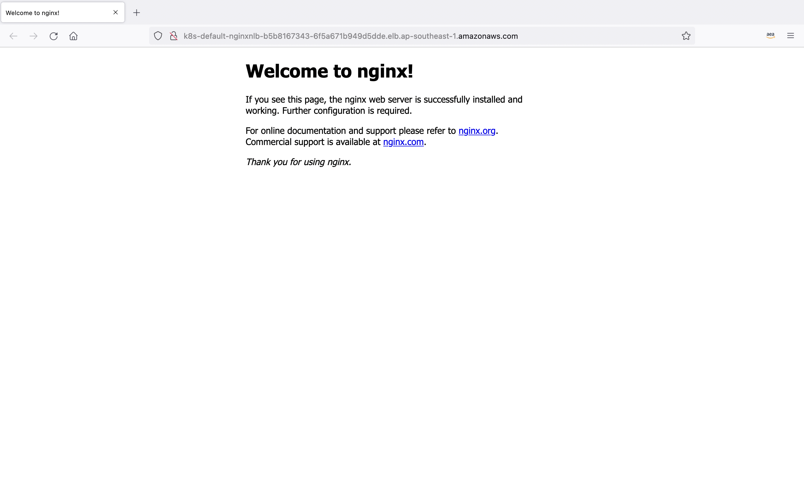

# 安装额外插件

## Metrics-Server

K8S的HPA依赖metrics-server，通过metrics-server，HPA可获得POD的CPU/内存等信息，进行横向伸缩。

```bash
ec2-user@~ > kubectl apply -f https://github.com/kubernetes-sigs/metrics-server/releases/latest/download/components.yaml
ec2-user@~ > kubectl get deployment metrics-server -n kube-system
NAME             READY   UP-TO-DATE   AVAILABLE   AGE
metrics-server   1/1     1            1           59s
ec2-user@~ > kubectl top node
NAME                                                CPU(cores)   CPU%   MEMORY(bytes)   MEMORY%
ip-172-31-117-202.ap-southeast-1.compute.internal   26m          1%     465Mi           6%
ip-172-31-132-99.ap-southeast-1.compute.internal    28m          1%     490Mi           6%
ip-172-31-96-196.ap-southeast-1.compute.internal    30m          1%     507Mi           7%
ec2-user@~ > kubectl top pod -n kube-system
NAME                              CPU(cores)   MEMORY(bytes)
aws-node-cf8pm                    3m           40Mi
aws-node-p2nq6                    2m           40Mi
aws-node-qhhnh                    2m           39Mi
coredns-cfcfc4887-9bpjn           1m           12Mi
coredns-cfcfc4887-f8n88           1m           12Mi
kube-proxy-9h94m                  1m           10Mi
kube-proxy-jp4pp                  1m           10Mi
kube-proxy-z9gz9                  1m           10Mi
metrics-server-64cf6869bd-9hdwk   2m           15Mi
```

参考链接：
[https://docs.aws.amazon.com/eks/latest/userguide/metrics-server.html](https://docs.aws.amazon.com/eks/latest/userguide/metrics-server.html)

## AWS Load Balancer Controller

默认情况下，创建Loadbalancer类型的kubernetes service，EKS会调用AWS Cloud Provider Load Balancer来创建CLB或NLB，目前该Controller项目已停止更新新特性，只bugfix。

延续方案为AWS Load Balancer Controller项目，AWS Load Balancer Controller同时实现了Loadbalancer(NLB)和Ingress(ALB)资源类型，通过注释支持ALB和NLB丰富的特性，例如ip类型的target，不需要通过NodePort转发，提供更好的延迟。

AWS Load Balancer Controller参考链接：

[https://kubernetes-sigs.github.io/aws-load-balancer-controller/v2.4/](https://kubernetes-sigs.github.io/aws-load-balancer-controller/v2.4/)

[https://docs.aws.amazon.com/eks/latest/userguide/aws-load-balancer-controller.html](https://docs.aws.amazon.com/eks/latest/userguide/aws-load-balancer-controller.html)

a) 创建AWS Load Balancer Controller运行需要的IAM策略

```bash
ec2-user@~ > curl -o iam_policy.json https://raw.githubusercontent.com/kubernetes-sigs/aws-load-balancer-controller/v2.4.1/docs/install/iam_policy.json
ec2-user@~ > aws iam create-policy \
    --policy-name AWSLoadBalancerControllerIAMPolicy \
    --policy-document file://iam_policy.json
```

b) 将创建的IAM策略附加到Role上

```bash
ec2-user@~ > export ACCOUNT_ID=$(aws sts get-caller-identity --query Account --output text)
ec2-user@~ > eksctl create iamserviceaccount \
  --cluster=demo \
  --namespace=kube-system \
  --name=aws-load-balancer-controller \
  --role-name "AmazonEKSLoadBalancerControllerRole" \
  --attach-policy-arn=arn:aws:iam::$ACCOUNT_ID:policy/AWSLoadBalancerControllerIAMPolicy \
  --approve
```

* eksctl除了创建Role，还创建了相关的ServiceAccount等资源，用于AWS Load Balancer Controller的运行

c) 通过Helm安装aws-load-balancer-controller插件

```bash
ec2-user@~ > helm repo add eks https://aws.github.io/eks-charts
ec2-user@~ > helm repo update
ec2-user@~ > helm install aws-load-balancer-controller eks/aws-load-balancer-controller \
  -n kube-system \
  --set clusterName=demo \
  --set serviceAccount.create=false \
  --set serviceAccount.name=aws-load-balancer-controller
```

* 替换`--set clusterName=`为自己的集群名

部署完成后，检查下aws-load-balancer-controller POD的运行状态。

```bash
ec2-user@~ > kubectl get deployment -n kube-system aws-load-balancer-controller
NAME                           READY   UP-TO-DATE   AVAILABLE   AGE
aws-load-balancer-controller   2/2     2            2           16s
```

d) 测试Loadbalancer资源

创建Loadbalancer资源需要通过Service资源的注释，让aws-load-balancer-controller来创建NLB资源。将以下内容保存为`nginx.yaml`文件

```yaml
apiVersion: apps/v1
kind: Deployment
metadata:
  name: nginx-lb-example
spec:
  replicas: 3
  selector:
    matchLabels:
      app: nginx
  template:
    metadata:
      labels:
        app: nginx
    spec:
      containers:
        - name: nginx
          image: public.ecr.aws/nginx/nginx:1.21
          ports:
            - name: tcp
              containerPort: 80
---
apiVersion: v1
kind: Service
metadata:
  name: nginx-nlb
  annotations:
    service.beta.kubernetes.io/aws-load-balancer-type: "external"
    service.beta.kubernetes.io/aws-load-balancer-scheme: "internet-facing"
    service.beta.kubernetes.io/aws-load-balancer-attributes: "load_balancing.cross_zone.enabled=true"
    service.beta.kubernetes.io/aws-load-balancer-backend-protocol: "tcp"
    service.beta.kubernetes.io/aws-load-balancer-nlb-target-type: "ip"
spec:
  ports:
    - port: 80
      targetPort: 80
      protocol: TCP
  type: LoadBalancer
  selector:
    app: nginx
```

通过kubectl命令创建kubernetes deployment、loadbalancer类型的service。

```bash
ec2-user@~ > kubectl create -f nginx.yaml
```

通过kubectl获取Loadbalancer的URL：`k8s-default-nginxnlb-b5b8167343-6f5a671b949d5dde.elb.ap-southeast-1.amazonaws.com`

```bash
ec2-user@~ > kubectl get svc
NAME         TYPE           CLUSTER-IP       EXTERNAL-IP                                                                         PORT(S)        AGE
kubernetes   ClusterIP      10.100.0.1       <none>                                                                              443/TCP        3h22m
nginx-nlb    LoadBalancer   10.100.241.143   k8s-default-nginxnlb-b5b8167343-6f5a671b949d5dde.elb.ap-southeast-1.amazonaws.com   80:30895/TCP   4s
```

* POD加入NLB有健康检查的时间以及DNS解析需要时间，预计需要等待3-5分钟后，访问Loadbalancer的URL[http://k8s-default-nginxnlb-b5b8167343-6f5a671b949d5dde.elb.ap-southeast-1.amazonaws.com](k8s-default-nginxnlb-b5b8167343-6f5a671b949d5dde.elb.ap-southeast-1.amazonaws.com)，可以看到nginx的首页



测试完成后删除相关资源：

```bash
ec2-user@~ > kubectl delete -f nginx.yaml
```

Loadbalancer类型的Service有非常丰富的注释来配置NLB，可参考以下链接：

[https://kubernetes-sigs.github.io/aws-load-balancer-controller/v2.4/guide/service/annotations/](https://kubernetes-sigs.github.io/aws-load-balancer-controller/v2.4/guide/service/annotations/)

e) 测试Ingress资源

创建Ingress资源时通过注释，让aws-load-balancer-controller来创建ALB资源。将以下内容保存为`game-2048.yaml`文件

```yaml
---
apiVersion: v1
kind: Namespace
metadata:
  name: game-2048
---
apiVersion: apps/v1
kind: Deployment
metadata:
  namespace: game-2048
  name: deployment-2048
spec:
  selector:
    matchLabels:
      app.kubernetes.io/name: app-2048
  replicas: 5
  template:
    metadata:
      labels:
        app.kubernetes.io/name: app-2048
    spec:
      containers:
      - image: public.ecr.aws/l6m2t8p7/docker-2048:latest
        imagePullPolicy: Always
        name: app-2048
        ports:
        - containerPort: 80
---
apiVersion: v1
kind: Service
metadata:
  namespace: game-2048
  name: service-2048
spec:
  ports:
    - port: 80
      targetPort: 80
      protocol: TCP
  type: NodePort
  selector:
    app.kubernetes.io/name: app-2048
---
apiVersion: networking.k8s.io/v1
kind: Ingress
metadata:
  namespace: game-2048
  name: ingress-2048
  annotations:
    alb.ingress.kubernetes.io/scheme: internet-facing
    alb.ingress.kubernetes.io/target-type: ip
spec:
  ingressClassName: alb
  rules:
    - http:
        paths:
        - path: /
          pathType: Prefix
          backend:
            service:
              name: service-2048
              port:
                number: 80
```

通过kubectl命令创建kubernetes namespace、deployment、service和ingress。

```bash
ec2-user@~ > kubectl create -f game-2048.yaml
```

通过kubectl获取ingress的URL：`k8s-game2048-ingress2-720d6cbe3a-340220005.ap-southeast-1.elb.amazonaws.com`

```bash
ec2-user@~ > kubectl get ingress -n game-2048
NAME           CLASS   HOSTS   ADDRESS                                                                       PORTS   AGE
ingress-2048   alb     *       k8s-game2048-ingress2-720d6cbe3a-340220005.ap-southeast-1.elb.amazonaws.com   80      25s
```

POD加入ALB有健康检查的时间以及DNS解析需要时间，预计需要等待3-5分钟后，访问Ingress的URL[k8s-game2048-ingress2-720d6cbe3a-340220005.ap-southeast-1.elb.amazonaws.com](k8s-game2048-ingress2-720d6cbe3a-340220005.ap-southeast-1.elb.amazonaws.com)，可以看到2048的游戏页面


测试完成后，删除相关资源

```bash
ec2-user@~ > kubectl delete -f game-2048.yaml
```

Ingress有非常丰富的注释来配置ALB，可参考以下链接：

[https://kubernetes-sigs.github.io/aws-load-balancer-controller/v2.4/guide/ingress/annotations/](https://kubernetes-sigs.github.io/aws-load-balancer-controller/v2.4/guide/ingress/annotations/)


## Karpenter on AWS

[Karpenter](https://karpenter.sh)是一个管理kubernetes集群伸缩的开源项目，相比Cluster Autoscaler，Karpenter更加自动，通过观察pending的Pod的聚合资源请求，快速增加剔除节点，以最大限度地减少调度延迟。建议新安装的EKS集群直接采用Karpenter而不是Cluster Autoscaling。

a) 环境变量设置

设置要安装的Karpenter版本

```bash
ec2-user@~ > export KARPENTER_VERSION=v0.10.0
```

设置集群名、Region、AWS账户ID、kube-apiserver的访问endpoint环境变量

```bash
ec2-user@~ > export CLUSTER_NAME="demo"
ec2-user@~ > export AWS_DEFAULT_REGION="ap-southeast-1"
ec2-user@~ > export AWS_ACCOUNT_ID="$(aws sts get-caller-identity --query Account --output text)"
ec2-user@~ > export CLUSTER_ENDPOINT=$(aws eks describe-cluster --name ${CLUSTER_NAME} --query cluster.endpoint --output text)
```

b) Karpenter Node IAM角色

Karpenter启动的实例必须使用InstanceProfile运行，该配置文件授予运行容器和配置网络所需的权限。Karpenter使用KarpenterNodeRole-${ClusterName}的名称发现InstanceProfile。

首先，使用AWS CloudFormation创建IAM资源。

```bash
ec2-user@~ > TEMPOUT=$(mktemp)
ec2-user@~ > curl -fsSL https://karpenter.sh/"${KARPENTER_VERSION}"/getting-started/getting-started-with-eksctl/cloudformation.yaml  > $TEMPOUT \
 && aws cloudformation deploy \
  --stack-name "Karpenter-${CLUSTER_NAME}" \
  --template-file "${TEMPOUT}" \
  --capabilities CAPABILITY_NAMED_IAM \
  --parameter-overrides "ClusterName=${CLUSTER_NAME}"
```

其次，授予对使用配置文件连接到集群的实例的访问权限。此命令将Karpenter节点角色添加到aws-auth配置中，允许具有此角色的节点连接到集群。

```bash
ec2-user@~ > eksctl create iamidentitymapping \
  --username system:node:{{EC2PrivateDNSName}} \
  --cluster "${CLUSTER_NAME}" \
  --arn "arn:aws:iam::${AWS_ACCOUNT_ID}:role/KarpenterNodeRole-${CLUSTER_NAME}" \
  --group system:bootstrappers \
  --group system:nodes
```

Karpenter需要启动实例等权限。这将创建一个IAM Role，Kubernetes ServiceAccount，并将它们关联起来。

```bash
ec2-user@~ > eksctl create iamserviceaccount \
  --cluster "${CLUSTER_NAME}" --name karpenter --namespace karpenter \
  --role-name "${CLUSTER_NAME}-karpenter" \
  --attach-policy-arn "arn:aws:iam::${AWS_ACCOUNT_ID}:policy/KarpenterControllerPolicy-${CLUSTER_NAME}" \
  --role-only \
  --approve

ec2-user@~ > export KARPENTER_IAM_ROLE_ARN="arn:aws:iam::${AWS_ACCOUNT_ID}:role/${CLUSTER_NAME}-karpenter"
```

仅当您第一次在此帐户中使用EC2 Spot时，才需要此步骤，如果之前运行过spot实例，下面命令会报错，请忽略。

```bash
ec2-user@~ > aws iam create-service-linked-role --aws-service-name spot.amazonaws.com
```

Karpenter通过tag `securityGroupSelector`的`subnetSelector`来发现启动节点需要的subnet和安全组资源，这里为subnet添加`karpenter.sh/discovery: ${CLUSTER_NAME}` tag。

```bash
ec2-user@~ > export SUBNET_IDS=$(aws eks describe-cluster --name $CLUSTER_NAME  --query "cluster.resourcesVpcConfig.subnetIds[]" --output text)

ec2-user@~ > aws ec2 create-tags \
    --resources $SUBNET_IDS \
    --tags Key="karpenter.sh/discovery",Value=${CLUSTER_NAME}
```

c) 安装Karpenter

增加karpenter的helm仓库

```bash
ec2-user@~ > helm repo add karpenter https://charts.karpenter.sh/
ec2-user@~ > helm repo update
```

通过Helm安装Karpenter

```bash
ec2-user@~ > helm upgrade --install --namespace karpenter --create-namespace \
  karpenter karpenter/karpenter \
  --version ${KARPENTER_VERSION} \
  --set serviceAccount.annotations."eks\.amazonaws\.com/role-arn"=${KARPENTER_IAM_ROLE_ARN} \
  --set clusterName=${CLUSTER_NAME} \
  --set clusterEndpoint=${CLUSTER_ENDPOINT} \
  --set aws.defaultInstanceProfile=KarpenterNodeInstanceProfile-${CLUSTER_NAME} \
  --wait # for the defaulting webhook to install before creating a Provisioner

ec2-user@~ > kubectl get all -n karpenter
NAME                             READY   STATUS    RESTARTS   AGE
pod/karpenter-7594557f48-tp8cx   2/2     Running   0          69s

NAME                TYPE        CLUSTER-IP      EXTERNAL-IP   PORT(S)            AGE
service/karpenter   ClusterIP   10.100.37.106   <none>        8080/TCP,443/TCP   70s

NAME                        READY   UP-TO-DATE   AVAILABLE   AGE
deployment.apps/karpenter   1/1     1            1           70s

NAME                                   DESIRED   CURRENT   READY   AGE
replicaset.apps/karpenter-7594557f48   1         1         1       69s
```

d) 配置Provisioner

Karpenter Provisioners是一组kubernetes的CRD，使用户能够在其集群中配置Karpenter的约束，如实例类型、AZ等。Pending的pod将由任何符合pod要求的Provisioner处理。如果多个预置器符合pod要求，则随机选择一个，因此建议将预置程序设置为相互排斥，参考[EKS Best Practices Guide for Karpenter](https://aws.github.io/aws-eks-best-practices/karpenter/#create-provisioners-that-are-mutually-exclusive)。如果要选择特定的provisioner，请使用node selector `karpenter.sh/provisioner-name: <provisioner-name>`

```bash
ec2-user@~ > cat <<EOF | kubectl apply -f -
apiVersion: karpenter.sh/v1alpha5
kind: Provisioner
metadata:
  name: default
spec:
  requirements:
    - key: karpenter.sh/capacity-type
      operator: In
      values: ["spot"]
    - key: node.kubernetes.io/instance-type
      operator: In
      values: ["m6i.large", "m6i.xlarge"]
  limits:
    resources:
      cpu: 1000
  provider:
    subnetSelector:
      karpenter.sh/discovery: ${CLUSTER_NAME}
    securityGroupSelector:
      kubernetes.io/cluster/${CLUSTER_NAME}: owned
  ttlSecondsAfterEmpty: 30
EOF
```

* [https://karpenter.sh/v0.10.0/tasks/provisioning/](https://karpenter.sh/v0.10.0/tasks/provisioning/)
* [https://karpenter.sh/v0.10.0/provisioner/](https://karpenter.sh/v0.10.0/provisioner/)

e) 测试Karpenter

创建一个deployment用于来测试karpenter能否正常伸缩集群规模

```bash
ec2-user@~ > cat <<EOF | kubectl apply -f -
apiVersion: apps/v1
kind: Deployment
metadata:
  name: inflate
spec:
  replicas: 0
  selector:
    matchLabels:
      app: inflate
  template:
    metadata:
      labels:
        app: inflate
    spec:
      terminationGracePeriodSeconds: 0
      containers:
        - name: inflate
          image: public.ecr.aws/eks-distro/kubernetes/pause:3.2
          resources:
            requests:
              cpu: 1
EOF
```

检查节点状态，并将workload扩展到20个replicas，观察karpenter的日志

```bash
ec2-user@~ > kubectl scale deployment inflate --replicas 20
deployment.apps/inflate scaled
ec2-user@~ > kubectl logs -f -n karpenter -l app.kubernetes.io/name=karpenter -c controller
```

查看pod和节点的状态，节点已增加，并且POD已经扩展到20个

```bash
ec2-user@~ > kubectl get pod
NAME                       READY   STATUS    RESTARTS   AGE
inflate-6b88c9fb68-4ssjx   1/1     Running   0          2m3s
inflate-6b88c9fb68-4wps6   1/1     Running   0          2m3s
inflate-6b88c9fb68-4xgct   1/1     Running   0          2m3s
inflate-6b88c9fb68-5bv9s   1/1     Running   0          2m3s
inflate-6b88c9fb68-9669r   1/1     Running   0          2m3s
inflate-6b88c9fb68-clqkd   1/1     Running   0          2m3s
inflate-6b88c9fb68-dnc8c   1/1     Running   0          2m3s
inflate-6b88c9fb68-fbx8c   1/1     Running   0          2m3s
inflate-6b88c9fb68-fmmfs   1/1     Running   0          2m3s
inflate-6b88c9fb68-hwgc7   1/1     Running   0          2m3s
inflate-6b88c9fb68-ksvmg   1/1     Running   0          2m3s
inflate-6b88c9fb68-pkrpl   1/1     Running   0          2m3s
inflate-6b88c9fb68-ppcdf   1/1     Running   0          2m3s
inflate-6b88c9fb68-qfsk5   1/1     Running   0          2m3s
inflate-6b88c9fb68-qrnxt   1/1     Running   0          2m3s
inflate-6b88c9fb68-sfg7c   1/1     Running   0          2m3s
inflate-6b88c9fb68-t2g76   1/1     Running   0          2m3s
inflate-6b88c9fb68-t75dg   1/1     Running   0          2m3s
inflate-6b88c9fb68-xff49   1/1     Running   0          2m3s
inflate-6b88c9fb68-z8jmm   1/1     Running   0          2m3s

ec2-user@~ > kubectl get node
NAME                                                STATUS   ROLES    AGE     VERSION
ip-172-31-100-141.ap-southeast-1.compute.internal   Ready    <none>   2m7s    v1.22.6-eks-7d68063
ip-172-31-101-124.ap-southeast-1.compute.internal   Ready    <none>   2m7s    v1.22.6-eks-7d68063
ip-172-31-103-71.ap-southeast-1.compute.internal    Ready    <none>   2m7s    v1.22.6-eks-7d68063
ip-172-31-104-157.ap-southeast-1.compute.internal   Ready    <none>   2m7s    v1.22.6-eks-7d68063
ip-172-31-110-196.ap-southeast-1.compute.internal   Ready    <none>   2m7s    v1.22.6-eks-7d68063
ip-172-31-117-202.ap-southeast-1.compute.internal   Ready    <none>   3d14h   v1.22.6-eks-7d68063
ip-172-31-132-99.ap-southeast-1.compute.internal    Ready    <none>   3d14h   v1.22.6-eks-7d68063
ip-172-31-96-196.ap-southeast-1.compute.internal    Ready    <none>   3d14h   v1.22.6-eks-7d68063
ip-172-31-97-226.ap-southeast-1.compute.internal    Ready    <none>   2m7s    v1.22.6-eks-7d68063

ec2-user@~ > kubectl logs  -n karpenter -l app.kubernetes.io/name=karpenter -c controller
2022-05-10T04:35:21.390Z	INFO	controller	Launched instance: i-0de2575ffe2589d78, hostname: ip-172-31-101-124.ap-southeast-1.compute.internal, type: m6i.xlarge, zone: ap-southeast-1a, capacityType: spot	{"commit": "00661aa", "provisioner": "default"}
2022-05-10T04:35:21.395Z	INFO	controller	Created node with 3 pods requesting {"cpu":"3155m","memory":"120Mi","pods":"6"} from types m6i.xlarge	{"commit": "00661aa", "provisioner": "default"}
2022-05-10T04:35:21.397Z	INFO	controller	Created node with 3 pods requesting {"cpu":"3155m","memory":"120Mi","pods":"6"} from types m6i.xlarge	{"commit": "00661aa", "provisioner": "default"}
2022-05-10T04:35:21.416Z	INFO	controller	Launched instance: i-0a00c8d3cb17caf53, hostname: ip-172-31-103-71.ap-southeast-1.compute.internal, type: m6i.xlarge, zone: ap-southeast-1a, capacityType: spot	{"commit": "00661aa", "provisioner": "default"}
2022-05-10T04:35:21.427Z	INFO	controller	Created node with 3 pods requesting {"cpu":"3155m","memory":"120Mi","pods":"6"} from types m6i.xlarge	{"commit": "00661aa", "provisioner": "default"}
2022-05-10T04:35:21.439Z	INFO	controller	Launched instance: i-0d3b96e9be3d83648, hostname: ip-172-31-100-141.ap-southeast-1.compute.internal, type: m6i.xlarge, zone: ap-southeast-1a, capacityType: spot	{"commit": "00661aa", "provisioner": "default"}
2022-05-10T04:35:21.469Z	INFO	controller	Created node with 3 pods requesting {"cpu":"3155m","memory":"120Mi","pods":"6"} from types m6i.xlarge	{"commit": "00661aa", "provisioner": "default"}
2022-05-10T04:35:21.472Z	INFO	controller	Created node with 3 pods requesting {"cpu":"3155m","memory":"120Mi","pods":"6"} from types m6i.xlarge	{"commit": "00661aa", "provisioner": "default"}
2022-05-10T04:35:21.537Z	INFO	controller	Waiting for unschedulable pods	{"commit": "00661aa"}
2022-05-10T04:36:53.218Z	DEBUG	controller.aws.launchtemplate	Deleted launch template lt-079056ac807699f7b	{"commit": "00661aa"}
```

删除deployment，观察集群的收缩

```bash
ec2-user@~ > kubectl delete deployments.apps inflate

deployment.apps "inflate" deleted
ec2-user@~ > date
Tue May 10 04:43:42 UTC 2022

2022-05-10T04:43:40.622Z	INFO	controller.node	Added TTL to empty node	{"commit": "00661aa", "node": "ip-172-31-100-141.ap-southeast-1.compute.internal"}
2022-05-10T04:43:40.872Z	INFO	controller.node	Added TTL to empty node	{"commit": "00661aa", "node": "ip-172-31-101-124.ap-southeast-1.compute.internal"}
2022-05-10T04:43:40.924Z	INFO	controller.node	Added TTL to empty node	{"commit": "00661aa", "node": "ip-172-31-104-157.ap-southeast-1.compute.internal"}
2022-05-10T04:43:40.970Z	INFO	controller.node	Added TTL to empty node	{"commit": "00661aa", "node": "ip-172-31-97-226.ap-southeast-1.compute.internal"}
2022-05-10T04:43:41.027Z	INFO	controller.node	Added TTL to empty node	{"commit": "00661aa", "node": "ip-172-31-110-196.ap-southeast-1.compute.internal"}
2022-05-10T04:43:41.118Z	INFO	controller.node	Added TTL to empty node	{"commit": "00661aa", "node": "ip-172-31-103-71.ap-southeast-1.compute.internal"}
2022-05-10T04:44:10.001Z	INFO	controller.node	Triggering termination after 30s for empty node	{"commit": "00661aa", "node": "ip-172-31-100-141.ap-southeast-1.compute.internal"}
2022-05-10T04:44:10.001Z	INFO	controller.node	Triggering termination after 30s for empty node	{"commit": "00661aa", "node": "ip-172-31-97-226.ap-southeast-1.compute.internal"}
2022-05-10T04:44:10.001Z	INFO	controller.node	Triggering termination after 30s for empty node	{"commit": "00661aa", "node": "ip-172-31-101-124.ap-southeast-1.compute.internal"}
2022-05-10T04:44:10.002Z	INFO	controller.node	Triggering termination after 30s for empty node	{"commit": "00661aa", "node": "ip-172-31-104-157.ap-southeast-1.compute.internal"}
2022-05-10T04:44:10.059Z	INFO	controller.termination	Cordoned node	{"commit": "00661aa", "node": "ip-172-31-100-141.ap-southeast-1.compute.internal"}
2022-05-10T04:44:10.062Z	INFO	controller.termination	Cordoned node	{"commit": "00661aa", "node": "ip-172-31-101-124.ap-southeast-1.compute.internal"}
2022-05-10T04:44:10.066Z	INFO	controller.termination	Cordoned node	{"commit": "00661aa", "node": "ip-172-31-97-226.ap-southeast-1.compute.internal"}
2022-05-10T04:44:10.079Z	INFO	controller.termination	Cordoned node	{"commit": "00661aa", "node": "ip-172-31-104-157.ap-southeast-1.compute.internal"}
2022-05-10T04:44:10.296Z	INFO	controller.termination	Deleted node	{"commit": "00661aa", "node": "ip-172-31-97-226.ap-southeast-1.compute.internal"}
2022-05-10T04:44:10.301Z	INFO	controller.termination	Deleted node	{"commit": "00661aa", "node": "ip-172-31-100-141.ap-southeast-1.compute.internal"}
2022-05-10T04:44:10.334Z	INFO	controller.termination	Deleted node	{"commit": "00661aa", "node": "ip-172-31-101-124.ap-southeast-1.compute.internal"}
2022-05-10T04:44:10.367Z	INFO	controller.termination	Deleted node	{"commit": "00661aa", "node": "ip-172-31-104-157.ap-southeast-1.compute.internal"}
2022-05-10T04:44:11.001Z	INFO	controller.node	Triggering termination after 30s for empty node	{"commit": "00661aa", "node": "ip-172-31-103-71.ap-southeast-1.compute.internal"}
2022-05-10T04:44:11.001Z	INFO	controller.node	Triggering termination after 30s for empty node	{"commit": "00661aa", "node": "ip-172-31-110-196.ap-southeast-1.compute.internal"}
2022-05-10T04:44:11.032Z	INFO	controller.termination	Cordoned node	{"commit": "00661aa", "node": "ip-172-31-110-196.ap-southeast-1.compute.internal"}
2022-05-10T04:44:11.042Z	INFO	controller.termination	Cordoned node	{"commit": "00661aa", "node": "ip-172-31-103-71.ap-southeast-1.compute.internal"}
2022-05-10T04:44:11.216Z	INFO	controller.termination	Deleted node	{"commit": "00661aa", "node": "ip-172-31-110-196.ap-southeast-1.compute.internal"}
2022-05-10T04:44:11.323Z	INFO	controller.termination	Deleted node	{"commit": "00661aa", "node": "ip-172-31-103-71.ap-southeast-1.compute.internal"}
```

参考链接：
* [https://karpenter.sh/v0.10.0/aws/provisioning/](https://karpenter.sh/v0.10.0/aws/provisioning/)
* [https://aws.github.io/aws-eks-best-practices/karpenter/](https://aws.github.io/aws-eks-best-practices/karpenter/)
* [https://karpenter.sh/v0.10.0/faq/](https://karpenter.sh/v0.10.0/faq/)

## Cluster Autoscaler

Cluster Autoscaler依托于EC2的Autoscaling Group实现，通过CA，可对集群的规模进行横向伸缩，满足业务弹性需求。上文也介绍了Karpenter来管理集群伸缩，Karpenter和Cluster Autoscaler二选一即可，首选Karpenter。

Cluster Autoscaler要求节点具有以下的标签，部署前检查节点的tag信息

|key|value|
|----|----|
| k8s.io/cluster-autoscaler/\<cluster-name\> | owned|
|k8s.io/cluster-autoscaler/enabled | true|

a) 为Cluster Autoscaler创建IAM策略

```json
ec2-user@~ > vi cluster-autoscaler-policy.json
{
    "Version": "2012-10-17",
    "Statement": [
        {
            "Sid": "VisualEditor0",
            "Effect": "Allow",
            "Action": [
                "autoscaling:SetDesiredCapacity",
                "autoscaling:TerminateInstanceInAutoScalingGroup"
            ],
            "Resource": "*",
            "Condition": {
                "StringEquals": {
                    "aws:ResourceTag/k8s.io/cluster-autoscaler/demo": "owned"
                }
            }
        },
        {
            "Sid": "VisualEditor1",
            "Effect": "Allow",
            "Action": [
                "autoscaling:DescribeAutoScalingInstances",
                "autoscaling:DescribeAutoScalingGroups",
                "ec2:DescribeLaunchTemplateVersions",
                "autoscaling:DescribeTags",
                "autoscaling:DescribeLaunchConfigurations"
            ],
            "Resource": "*"
        }
    ]
}
```

* 将`aws:ResourceTag/k8s.io/cluster-autoscaler/demo`的`demo`替换为自己的集群名

创建名为`AmazonEKSClusterAutoscalerPolicy`的IAM策略

```bash
ec2-user@~ > aws iam create-policy \
  --policy-name AmazonEKSClusterAutoscalerPolicy \
  --policy-document file://cluster-autoscaler-policy.json
```

b) 为Cluster Autoscaler创建IAM Role，并绑定到kubernetes ServiceAccount

```bash
ec2-user@~ > export ACCOUNT_ID=$(aws sts get-caller-identity --query Account --output text)
ec2-user@~ > eksctl create iamserviceaccount \
  --cluster=demo \
  --namespace=kube-system \
  --name=cluster-autoscaler \
  --attach-policy-arn=arn:aws:iam::$ACCOUNT_ID:policy/AmazonEKSClusterAutoscalerPolicy \
  --override-existing-serviceaccounts \
  --approve
```

* 注意该eksctl命令的输出，包含名为`eksctl-demo-addon-iamserviceaccount-kube-system-cluster-autoscaler`的cloudformation stack名，需要通过该名称获取Cluster Autoscaler IAM Role的ARN

获取Cluster Autoscaler IAM Role的ARN

```bash
ec2-user@~ > aws cloudformation describe-stacks --stack-name  eksctl-demo-addon-iamserviceaccount-kube-system-cluster-autoscaler |jq '.Stacks[].Outputs[]'
{
  "OutputKey": "Role1",
  "OutputValue": "arn:aws:iam::<xxxxxxx>:role/eksctl-demo-addon-iamserviceaccount-kube-sys-Role1-1RAQWJQ1H3F31"
}
```

c) 创建Cluster Autoscaler

下载Cluster Autoscaler插件的yaml配置文件

```bash
ec2-user@~ > curl -o cluster-autoscaler-autodiscover.yaml https://raw.githubusercontent.com/kubernetes/autoscaler/master/cluster-autoscaler/cloudprovider/aws/examples/cluster-autoscaler-autodiscover.yaml
```

编辑cluster-autoscaler-autodiscover.yaml，找到`--node-group-auto-discovery=asg:tag=k8s.io/cluster-autoscaler/enabled,k8s.io/cluster-autoscaler/<YOUR CLUSTER NAME>`,将`<YOUR CLUSTER NAME>`设置为集群名，本例中为"demo"

```bash
ec2-user@~ > sed  -i 's/<YOUR CLUSTER NAME>/demo/' cluster-autoscaler-autodiscover.yaml
ec2-user@~ > grep "demo" cluster-autoscaler-autodiscover.yaml
            - --node-group-auto-discovery=asg:tag=k8s.io/cluster-autoscaler/enabled,k8s.io/cluster-autoscaler/demo
```


安装插件，并检查运行状态

```bash
ec2-user@~ > kubectl apply -f cluster-autoscaler-autodiscover.yaml
ec2-user@~ > kubectl get deployments.apps -n kube-system
NAME                           READY   UP-TO-DATE   AVAILABLE   AGE
aws-load-balancer-controller   2/2     2            2           25h
cluster-autoscaler             1/1     1            1           2m
coredns                        2/2     2            2           28h
ebs-csi-controller             2/2     2            2           53m
metrics-server                 1/1     1            1           27h
```

d) 安装后的配置工作

为cluster-autoscaler ServiceAccount添加注释，设置IAM Role

```bash
ec2-user@~ > kubectl annotate serviceaccount cluster-autoscaler \
  -n kube-system \
  eks.amazonaws.com/role-arn=arn:aws:iam::$ACCOUNT_ID:role/eksctl-demo-addon-iamserviceaccount-kube-sys-Role1-1RAQWJQ1H3F31
```

当POD设置有`cluster-autoscaler.kubernetes.io/safe-to-evict=false`注释时，可以防止节点被Cluster Autoscaler删除

```bash
ec2-user@~ > kubectl patch deployment cluster-autoscaler \
  -n kube-system \
  -p '{"spec":{"template":{"metadata":{"annotations":{"cluster-autoscaler.kubernetes.io/safe-to-evict": "false"}}}}}'
```

e) 测试Cluster Autoscaler功能

创建一个deployment workload，通过增加replicas数量，增加资源消耗，触发节点自动扩展

```bash
ec2-user@~ > cat > nginx-ca.yaml << EOF
apiVersion: apps/v1
kind: Deployment
metadata:
  name: nginx-to-scaleout
spec:
  replicas: 1
  selector:
    matchLabels:
      app: nginx
  template:
    metadata:
      labels:
        service: nginx
        app: nginx
    spec:
      containers:
      - image: nginx
        name: nginx-to-scaleout
        resources:
          limits:
            cpu: 500m
            memory: 512Mi
          requests:
            cpu: 500m
            memory: 512Mi
EoF
```

```bash
ec2-user@~ > kubectl apply -f nginx-ca.yaml
ec2-user@~ > kubectl get deployment/nginx-to-scaleout
NAME                READY   UP-TO-DATE   AVAILABLE   AGE
nginx-to-scaleout   1/1     1            1           11s
ec2-user@~ > kubectl scale --replicas=20 deployment/nginx-to-scaleout
ec2-user@~ > kubectl get node
NAME                                                STATUS   ROLES    AGE   VERSION
ip-172-31-111-158.ap-southeast-1.compute.internal   Ready    <none>   3m21s   v1.22.6-eks-7d68063
ip-172-31-115-193.ap-southeast-1.compute.internal   Ready    <none>   3m40s   v1.22.6-eks-7d68063
ip-172-31-117-202.ap-southeast-1.compute.internal   Ready    <none>   18h     v1.22.6-eks-7d68063
ip-172-31-132-99.ap-southeast-1.compute.internal    Ready    <none>   18h     v1.22.6-eks-7d68063
ip-172-31-141-184.ap-southeast-1.compute.internal   Ready    <none>   3m28s   v1.22.6-eks-7d68063
ip-172-31-96-196.ap-southeast-1.compute.internal    Ready    <none>   18h     v1.22.6-eks-7d68063
```

删除工作负载，触发集群自动缩容

```bash
ec2-user@~ > kubectl delete -f nginx-ca.yaml
ec2-user@~ > kubectl top node
NAME                                                CPU(cores)   CPU%   MEMORY(bytes)   MEMORY%
ip-172-31-117-202.ap-southeast-1.compute.internal   28m          1%     625Mi           8%
ip-172-31-132-99.ap-southeast-1.compute.internal    36m          1%     700Mi           9%
ip-172-31-96-196.ap-southeast-1.compute.internal    30m          1%     626Mi           8%
```

自动缩容需要等待较长时间，请耐心等待

参考链接：
[https://docs.aws.amazon.com/eks/latest/userguide/autoscaling.html](https://docs.aws.amazon.com/eks/latest/userguide/autoscaling.html)

## Container Insight

a) 设置IAM角色

需要给节点组运行的Role附加`CloudWatchAgentServerPolicy`托管策略，才能将日志和指标信息输出到Cloudwatch

```bash
ec2-user@~ > export clusterName="demo"
ec2-user@~ > nodeGroupName=$(aws eks list-nodegroups --cluster-name $clusterName --query 'nodegroups[0]' --output text)
ec2-user@~ > roleName=$(aws eks describe-nodegroup --cluster-name $clusterName --nodegroup-name $nodeGroupName --query 'nodegroup.nodeRole' --output text | sed 's/^arn.*\///')
ec2-user@~ > policyARN=$(aws iam list-policies --query 'Policies[?PolicyName==`CloudWatchAgentServerPolicy`].Arn' --output text)
ec2-user@~ > aws iam attach-role-policy --role-name $roleName --policy-arn $policyARN
```

b) 安装CW和FluentBit代理

```bash
ClusterName=demo
RegionName=ap-southeast-1
FluentBitHttpPort='2020'
FluentBitReadFromHead='Off'
[[ ${FluentBitReadFromHead} = 'On' ]] && FluentBitReadFromTail='Off'|| FluentBitReadFromTail='On'
[[ -z ${FluentBitHttpPort} ]] && FluentBitHttpServer='Off' || FluentBitHttpServer='On'
curl https://raw.githubusercontent.com/aws-samples/amazon-cloudwatch-container-insights/latest/k8s-deployment-manifest-templates/deployment-mode/daemonset/container-insights-monitoring/quickstart/cwagent-fluent-bit-quickstart.yaml | sed 's/{{cluster_name}}/'${ClusterName}'/;s/{{region_name}}/'${RegionName}'/;s/{{http_server_toggle}}/"'${FluentBitHttpServer}'"/;s/{{http_server_port}}/"'${FluentBitHttpPort}'"/;s/{{read_from_head}}/"'${FluentBitReadFromHead}'"/;s/{{read_from_tail}}/"'${FluentBitReadFromTail}'"/' | kubectl apply -f -
```

c) 检查Container Insight运行

```bash
ec2-user@~ > kubectl get all -n amazon-cloudwatch
NAME                         READY   STATUS    RESTARTS   AGE
pod/cloudwatch-agent-d968z   1/1     Running   0          2m
pod/cloudwatch-agent-psgvn   1/1     Running   0          2m
pod/cloudwatch-agent-s8x8p   1/1     Running   0          2m
pod/fluent-bit-bx425         1/1     Running   0          2m
pod/fluent-bit-ds7g2         1/1     Running   0          2m
pod/fluent-bit-skj67         1/1     Running   0          2m

NAME                              DESIRED   CURRENT   READY   UP-TO-DATE   AVAILABLE   NODE SELECTOR   AGE
daemonset.apps/cloudwatch-agent   3         3         3       3            3           <none>          2m
daemonset.apps/fluent-bit         3         3         3       3            3           <none>          2m
```

d）查看Cloudwatch面板


