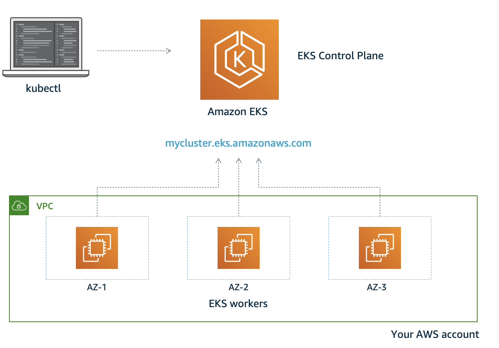

# 快速部署EKS集群

EKS将集群分为Control Plane和Worker节点：
- 其中Control plane部署在托管VPC，包括kube-apiserver、kube-scheduler、kube-controller-manager、etcd集群，高可用且弹性伸缩，完全托管
- Worker节点以NodeGroup方式部署(基于autoscaling group)，通过托管VPC暴露的endpoint访问kube-apiserver加入集群

EKS集群的安装主要包括以下步骤：

- [客户端工具安装](./01-%E5%AE%A2%E6%88%B7%E7%AB%AF%E5%B7%A5%E5%85%B7.md)
- [集群网络规划](./02-%E9%9B%86%E7%BE%A4%E7%BD%91%E7%BB%9C%E8%A7%84%E5%88%92.md)
- [集群Control Plane部署](./03-%E9%9B%86%E7%BE%A4ControlPlane%E9%83%A8%E7%BD%B2.md)
- [集群Worker节点部署](./04-%E9%9B%86%E7%BE%A4Worker%E9%83%A8%E7%BD%B2.md)
- [安装额外插件](./05-%E9%A2%9D%E5%A4%96%E6%8F%92%E4%BB%B6%E5%AE%89%E8%A3%85.md)